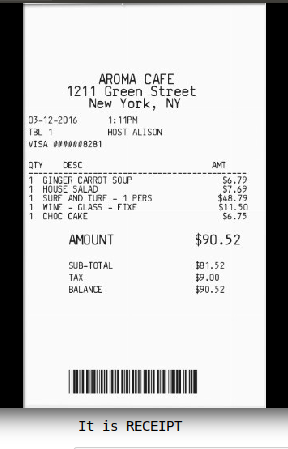

## Receipt Classification From Image - Receipt/Not Receipt                                
ML Pipeline:
Dataset Collection(Positive + Negative) --> Image to text conversion --> Processing on text --> Converting processed text into numerical data --> Train classifier --> Test classifier(Input is image)

1) Dataset Collection-

* Dataset scraped through internet. Wrote a code using "selenium-webdriver" python package to download images using query. Downloaded image count is 882 (546(receipt images) + 336(not receipt images)). Gathered both positive and negative samples in one folder(IMAGE_DATA which is not included in folder because of memory concerns) with positive examples names changes to 'POS_' + name of image and negative examples names changes to 'NEG_'+name of image which will help in labelling.
* Example use: python image_download.py 'query name' numbers-of-images-to-download
    
2) Image to text conversion-

* Text is extracted from the downloaded images using python OCR - 'pytesseract' and saved that into some different folder(TEXT_DATA)
* Example use: python convert_image_to_text.py '/image folder name/' '/folder name to save text files(TEXT_DATA)/'

3) Processing on text-

* Text extracted from the images need to be cleaned since there will be too much irrelevent information is present in the text file e.g some stop word - is, are etc. Preprocessing of the text is done in "train_classifier.py" file and Train Classifier section below .
* For preprocessing of the text Python 'spaCy' package is used. Preprocessing includes removing blank spaces, punctuation marks, making all the text into lower case, lemmatizing the words. Preprocessing mainly help to reduce the noise and irrelevant data in the text.

4) Converting processed text into numerical data-

* Machine learning algorithms understand numbers not text. To convert the text data into numbers "TfidfVectorizer" is used. This vectorizer will convert text into numbers on basis of how often this words came into text corpus as whole. It will give more weightage to rare words.

5) Train classifier-
* Training code is available in 'train_classifier.py'. Need to give path of 'TEXT_DATA' which we got from 'convert_image_to_text.py' eplained in the Image to text conversion section above.
* In Receipt filter oreder of the words does not matter much(similar to the Spam filter in the Emails). Experimented with 2 approaches using Naive Bayes classifier and SVM classifier.
* Using Naive Bayes classifier got test accuracy around 66 % and with the same data SVM classifier is giving around 86 % which is pretty good. Final model is trained with SVM classifier and saved model into pickle file(model.pkl).

6) Test classifier-
* Testing code is available in 'Testing Code.ipynb'. Need to give image path as user input.
* Testing code is available in python file 'test_classifier.py' here we need to specify image path as system argument.
* Example use for python script : python test_classifier.py './image.jpg'
* Output will be the string which is either RECEIPT" or "Not a RECEIPT"

